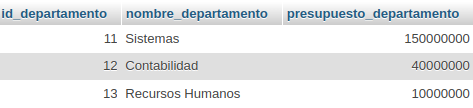
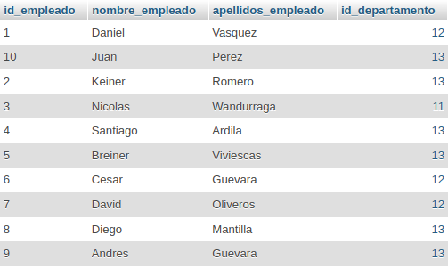
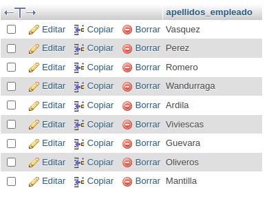
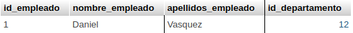
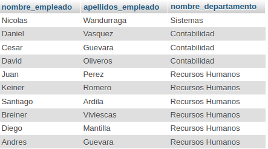

SELECT Empleado.nombre_empleado, Empleado.apellidos_empleado FROM Empleado 
JOIN Departamento ON Empleado.id_departamento = Departamento.id_departamento WHERE 
Departamento.presupuesto_departamento > 100000000;